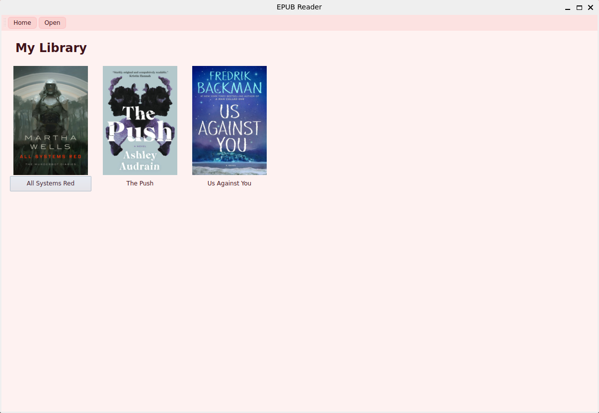
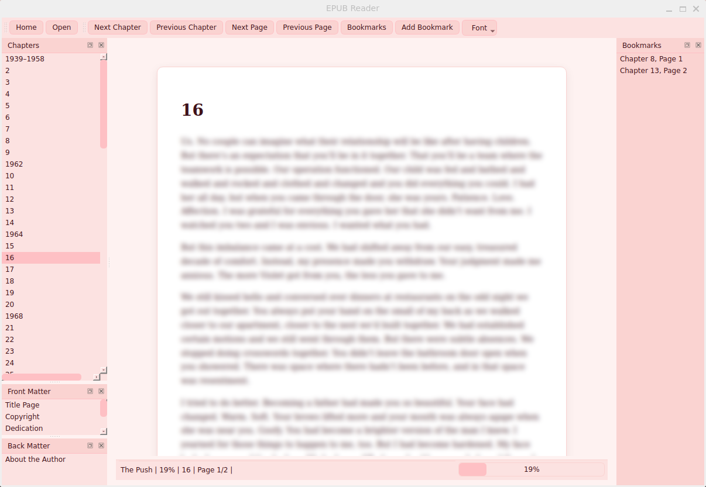

# EPUB Reader
A desktop EPUB reader built with PySide6 that provides a clean reading experience, persistent library management, bookmarks, reading progress tracking, customizable covers, and experimental machine learning features for document analysis.

## Why I Built This
Many EPUB readers are either web-based, overly complex, or lack a clean library experience. I built this project as a lightweight desktop reader focused on:

- A clean and enjoyable reading experience
- Persistent reading progress and library management
- Customizable book covers and organization
- Practical applications of Data Science, Machine Learning, and NLP
- Exploring how AI can enhance digital reading workflows

## Screenshots
### Library View


### Reader View
A clean reading experience with chapter navigation, bookmarks, and progress tracking. \


## Installation
Open a terminal and run the following commands: \
```git clone https://github.com/<username>/epub-reader.git```

```cd epub-reader```

```pip install -r requirements.txt```

```python main.py```

## Getting Started
### Open a Book
1. Launch the application.
2. Click Open.
3. Select an EPUB file.
4. The book is automatically added to your library.

### Open a Book From the Library
* Double-click a book cover on the Home screen.
* The reader will restore your last saved position.

## Keyboard Shortcuts
| Shortcut      | Action                   |
| ------------- | ------------------------ |
| Right Arrow   | Next page                |
| Left Arrow    | Previous page            |
| Space         | Next page                |
| Shift + Space | Previous page            |
| Ctrl + Right  | Next chapter             |
| Ctrl + Left   | Previous chapter         |
| Delete        | Delete selected bookmark |

## Library Management
### Change a Book Cover
1. Right-click a book on the Home page.
2. Select Replace Cover Image...
3. Choose an image file.

Supported formats: PNG, JPG, JPEG, WEBP

### Removing a Book From the Library
1. Right-click a book on the Home page.
2. Select Delete from Library.
3. Confirm deletion.
The original EPUB file is **not** deleted.

## Reading Progress
The application automatically saves the current chapter and page, as well as the last opened book. \
When the application starts, it automatically reopens the last book at the last saved location.

## Tips
* Use the Home page as your personal bookshelf.
* Right-click books for cover and library management options.
* Increase font size for easier reading.
* Use bookmarks to save favorite passages or return to important sections quickly.

**Enjoy your reading! 📚**


# Developer Info / Plans

## Architecture

- PySide6 / Qt for the desktop UI
- SQLite for persistent storage
- EbookLib for EPUB parsing
- Scikit-learn for machine learning experiments

## Experimental Features
In addition to serving as a desktop EPUB reader, this project is also used to explore practical applications of Data Science, Machine Learning, Artificial Intelligence, and Natural Language Processing.
 
Areas of current and future experimentation include:

## Experimental Features

In addition to serving as a desktop EPUB reader, this project is also used to explore practical applications of Data Science, Machine Learning, Artificial Intelligence, and Natural Language Processing.

> As a Data Scientist with a background in Computer Science, Machine Learning, and Artificial Intelligence, I use this project as a practical environment for experimenting with document understanding, information retrieval, and AI-assisted reading experiences.
---
Areas of current and future experimentation include:

### Data Science
- Reading Analytics
  - Reader analytics:
    - Books completed
    - Pages read
    - Reading sessions
    - Reading speed estimation
  - Book analytics:
    - Word count
    - Chapter statistics
    - Named character counts
    - Reading difficulty scores

- Document Analysis
  - Book structure analysis
  - Reading habit visualization
  - Reading progress insights

### Machine Learning
- Front Matter and Back Matter detection
  - Current implementation: Logistic Regression classifier trained on EPUB document structure features.
  - Future work: Automatic chapter classification, genre prediction, etc.
- Automatic chapter classification
- Genre prediction
- Book recommendation systems

### Natural Language Processing
- Metadata Enrichment
  - Automatic book tagging
  - Genre classification
  - Topic extraction
  - Metadata generation

- Content Understanding
  - Character extraction
  - Named entity recognition
  - Topic modeling
  - Semantic search within books

### Artificial Intelligence
- Optional AI-assisted book summaries
- Optional AI-assisted chapter summaries
- Personalized reading recommendations
- Retrieval-Augmented Generation (RAG) over personal libraries


## Roadmap

### Completed

- [x] EPUB file support
- [x] Persistent library management
- [x] Automatic reading progress tracking
- [x] Bookmark management
- [x] Chapter navigation
- [x] Front Matter navigation
- [x] Back Matter navigation
- [x] Adjustable font size
- [x] Custom book covers
- [x] Library cover gallery
- [x] Delete books from library
- [x] Remember last opened book
- [x] Keyboard shortcuts

### Planned

- [ ] Search within a book
- [ ] Light and dark modes
- [ ] Custom themes
- [ ] Reader statistics
- [ ] Favorite books
- [ ] Book sorting and filtering
- [ ] Reading difficulty analysis

### Machine Learning & NLP

- [x] Front Matter and Back Matter classification
- [ ] Automatic chapter classification
- [ ] Automatic metadata enrichment
- [ ] Genre prediction
- [ ] Topic extraction
- [ ] Character extraction
- [ ] Semantic search within books
- [ ] Personalized book recommendations

### Future Ideas

- [ ] Reader annotations and notes
- [ ] Reading goals and habit tracking
- [ ] Export and import bookmarks
- [ ] Cloud synchronization
- [ ] Support for PDF files
- [ ] AI-assisted chapter summaries
- [ ] AI-assisted book summaries
- [ ] Retrieval-Augmented Generation (RAG) over personal libraries
- [ ] Conversational search across a personal library

## Built With


